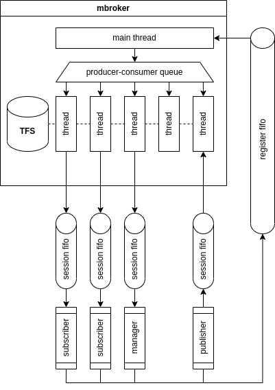

# TecnicoFS - Message Broker System

This repository contains the second phase of the **TecnicoFS** project, extending the initial file system into a networked **Message Broker** (Publish/Subscribe) system. The system allows multiple independent processes to communicate by publishing or subscribing to messages stored in "Message Boxes" within the TecnicoFS environment.

## Features

- **Client-Server Architecture**: A central server (`mbroker`) manages message boxes, while independent client processes (`publisher`, `subscriber`, `manager`) interact with it.
- **Message Boxes**: Fundamental units of communication where each box is mapped to a unique file within TecnicoFS.
- **Networked Communication**: Interaction between clients and the server is handled via Unix Domain Sockets (or named pipes/AF_INET depending on the specific implementation step).
- **Multi-Role Clients**:
    - **Publisher**: Connects to a specific box to post messages.
    - **Subscriber**: Connects to a box to receive and read available messages.
    - **Manager**: Responsible for administrative tasks like creating or deleting message boxes.
- **Concurrency Support**: The server handles multiple concurrent client requests using thread pools or dedicated threads, ensuring synchronization via mutexes.

---

## System Architecture




The system consists of four main components:
1.  **mbroker (Server)**: The heart of the system. It hosts the TecnicoFS instance and manages the lifecycle of message boxes.
2.  **Publisher (Client)**: A process that sends strings (messages) to a specific message box on the server.
3.  **Subscriber (Client)**: A process that listens for new messages appearing in a specific message box.
4.  **Manager (Client)**: A tool used to list, create, or remove message boxes (which internally triggers `tfs_open` or `tfs_unlink` on the server).

---

## Communication Protocol

Clients communicate with the `mbroker` using a defined request/response protocol:
* **Create/Remove**: The Manager requests the creation or deletion of a box.
* **Publish**: The Publisher sends a data packet containing the message content.
* **Subscribe**: The Subscriber requests a stream of messages from a specific box.

Each message box on the server side is backed by a TecnicoFS i-node. When a message is published, the server performs a `tfs_write`; when a subscriber reads, the server performs a `tfs_read`.

---

## Synchronization & Concurrency

This version of the project emphasizes **inter-process communication (IPC)** and **server-side threading**:
* **Global Mutex**: The core TecnicoFS operations are protected by a synchronization layer to ensure consistency during concurrent client requests.
* **Session Management**: The server tracks active connections and ensures that file handles are managed correctly even if a client disconnects abruptly.

---

## Running the System
Start the server:
```bash
./mbroker/mbroker <pipe_name/socket_path>
```
Run a Manager to create a box:
```bash
./manager/manager <socket_path> create /box1
```
Run a subscriber:
```bash
./subscriber/subscriber <socket_path> /box1
```
Publish a message:
```bash
./publisher/publisher <socket_path> /box1 "Hello World"
```


